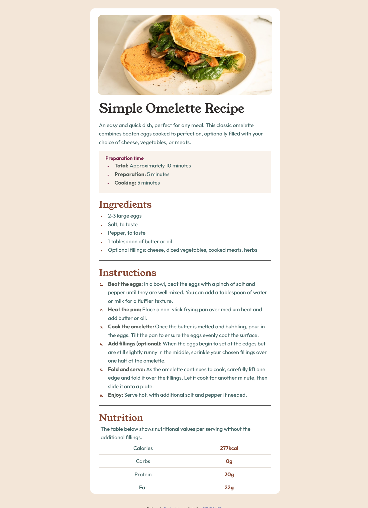

# Frontend Mentor - Recipe page solution

This is a solution to the [Recipe page challenge on Frontend Mentor](https://www.frontendmentor.io/challenges/recipe-page-KiTsR8QQKm). Frontend Mentor challenges help you improve your coding skills by building realistic projects. 

## Table of contents

- [Overview](Frontend mentor)
  - [The challenge](A recipe page built on HTML and CSS styling languages)
  - [Screenshot] 

- [My process](builing a Recipe page website)
  - [Built with](HTML and CSS markup and styling languages only)
  - [What I learned](using marker pseudo selector to select list-style-type and style them, using psuedo elements to select and style td in different or same tr and different nth-child)
  - [Continued development](learning CSS grid, more layout and responsive properties too)
  - [helped introduce me to HTML and CSS basics/intermediate] (https://www.sololearn.com)
  - [AI Collaboration](asked questions on chatGpt)
- [Author](ADEBISI DANIEL)
- [Acknowledgments](all acknowledgements to frontend mentor for making us able to practicalise on  realife projects)

## Overview
A recipe page website built on purely HTML and CSS languages

### Screenshot

### Links

- Solution URL: [Add solution URL here](https://github.com/Adelihte/Recipe-page.git)
- Live Site URL: [Add live site URL here](https://adelihte.github.io/Recipe-page/)

## My process

### Built with

- Semantic HTML5 markup
- CSS custom properties
- Flexbox
- Mobile-first workflow

### What I learned

I learnt how to target list-style-type and style it using the css ::marker pseudo selector.
i also learnt how to add lines using 
 tag, and i made a clean and good responsiveness of width and fonts on desktops and mobile.

i'm also happy able to use pseudo selector to target and style td in thesame and different tr using the code

table tr td:nth-child(2) {
  ...
}

### Continued development

styles and elements needing the pseudo element attribute targets, more on css responsiveness, css grid, and more webpages

### Useful resources

www.sololearn.com taught me html and css basics and some intermediate levels on their courses

### AI Collaboration

- What tools did you use (ChatGPT)
- How did you use them (Asking questions on areas i don't know)

## Author

- Website - [ADEBISI DANIEL](https://adelihte.github.io/Recipe-page/)
- Frontend Mentor - [@Adelihte](https://www.frontendmentor.io/profile/yourusername)
- Twitter - [@Adelihte](https://www.twitter.com/Adelihte)
